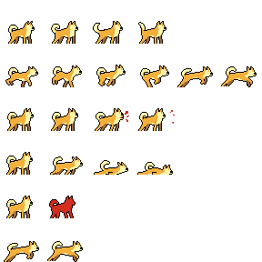

# Godot 2D : Player Animation

## Purpose

Example of a Player scene animated.
You can use this Github repository for your own games.

## This template includes

An animation handler using [AnimationTree](https://docs.godotengine.org/en/stable/tutorials/animation/animation_tree.html)

The `Level scene` to test the animation player.

The `Player scene` including :

- Idle animation
- Run animation
- Jump animation
- Attack animation
- Death animation

## Setup

Clone or download this repository and open it with Godot.
Before you run the project, you'll have to configure the user inputs for your game:

To create inputs for "move_right", "move_left", "jump", "attack" > go to `Project > Project Setting > Input Map`

## Resources

I used [FREE STREET ANIMAL PIXEL ART ASSET PACK](https://craftpix.net/freebies/free-street-animal-pixel-art-asset-pack/) from [Craftpix](https://craftpix.net/).

